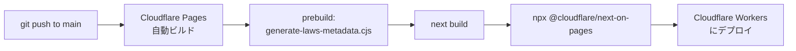
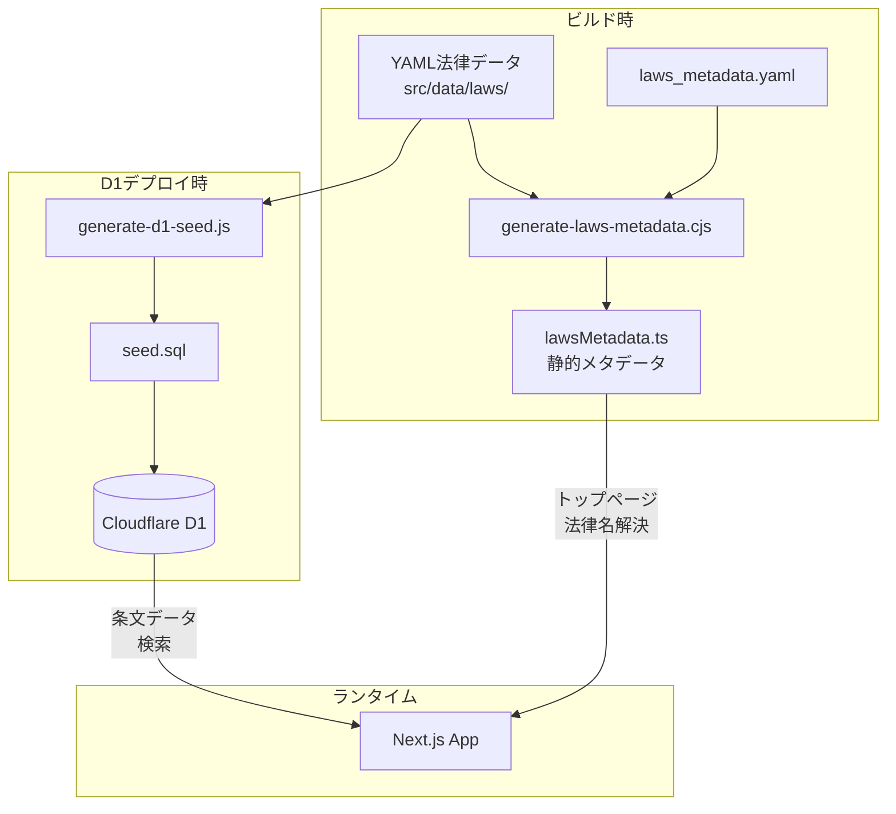

# アーキテクチャ仕様書

> 最終更新: 2026-04-13
> 対象: ソースコードの実装に基づく実態記録

---

## 1. システム概要

osaka-kenpo は、日本の法律条文を大阪弁に翻訳して表示する Web アプリケーションである。

| 項目           | 値                              |
| -------------- | ------------------------------- |
| フレームワーク | Next.js 15 (App Router)         |
| ランタイム     | Cloudflare Workers Edge Runtime |
| SSR            | @cloudflare/next-on-pages       |
| 言語           | TypeScript                      |
| UI             | React 19 + Tailwind CSS 3       |
| データベース   | Cloudflare D1 (SQLite)          |
| ホスティング   | Cloudflare Pages                |
| ドメイン       | osaka-kenpo.llll-ll.com         |

全ページが Edge Runtime (`export const runtime = 'edge'`) で動作し、Cloudflare Workers 上で SSR される。

## 2. 技術スタック一覧

### 本番依存（dependencies）

| パッケージ        | バージョン | 用途                                 |
| ----------------- | ---------- | ------------------------------------ |
| next              | 15.5.2     | フレームワーク                       |
| react / react-dom | 19.2.3     | UI ライブラリ                        |
| qrcode            | 1.5.4      | QRコード生成（/eeyan デバイス同期）  |
| js-yaml           | 4.1.1      | YAML パース（ビルドスクリプト）      |
| zod               | 4.0.17     | データバリデーション（条文スキーマ） |
| simple-icons      | 16.8.0     | SNS アイコン                         |
| xml2js            | 0.6.2      | XML パース（e-Gov API 法令取得）     |

### 開発依存（devDependencies）

| パッケージ                           | 用途                                 |
| ------------------------------------ | ------------------------------------ |
| @cloudflare/next-on-pages            | Cloudflare Pages 向け Next.js ビルド |
| @cloudflare/workers-types            | D1 型定義                            |
| wrangler                             | Cloudflare CLI                       |
| tailwindcss / postcss / autoprefixer | CSS                                  |
| eslint / eslint-config-next          | Lint                                 |
| prettier                             | フォーマッタ                         |
| husky / lint-staged                  | コミット前自動チェック               |
| typescript                           | 型チェック                           |

## 3. ディレクトリ構成

```
osaka-kenpo/
├── src/
│   ├── app/                          # Next.js App Router
│   │   ├── layout.tsx                # ルートレイアウト（ViewModeProvider, EeyanProvider, Header, Footer）
│   │   ├── page.tsx                  # トップページ（法律カード一覧）
│   │   ├── globals.css               # グローバル CSS
│   │   ├── about/
│   │   │   └── page.tsx              # About ページ
│   │   ├── eeyan/
│   │   │   └── page.tsx              # ええやん一覧ページ
│   │   ├── law/
│   │   │   └── [law_category]/
│   │   │       ├── page.tsx          # カテゴリページ
│   │   │       └── [law]/
│   │   │           ├── page.tsx      # 法律ページ（条文一覧）
│   │   │           ├── components/   # 法律ページ固有コンポーネント
│   │   │           └── [article]/
│   │   │               ├── page.tsx       # 条文ページ（サーバーコンポーネント）
│   │   │               ├── ArticleClient.tsx  # 条文ページ（クライアントコンポーネント）
│   │   │               └── components/    # 条文ページ固有コンポーネント
│   │   ├── api/
│   │   │   ├── eeyan/
│   │   │   │   └── route.ts          # ええやん API（D1）
│   │   │   └── article-image/
│   │   │       └── route.tsx         # OG 画像生成 API
│   │   ├── components/               # 共有コンポーネント（LikeButton, ShareButton, TotalViewCounter, ArticleViewCounter 等）
│   │   └── context/                  # React Context
│   │       ├── ViewModeContext.tsx    # 大阪弁/原文切替
│   │       └── EeyanContext.tsx      # ええやん変更通知
│   ├── components/                   # アプリ全体の共有コンポーネント
│   │   ├── icons.tsx                 # アイコンコンポーネント（EyeIcon 等）
│   │   ├── ErrorBoundary.tsx         # エラーバウンダリ
│   │   └── Button.tsx               # 汎用ボタン
│   ├── data/
│   │   ├── laws_metadata.yaml        # 法律カテゴリ構造定義（真実の源）
│   │   ├── lawsMetadata.ts           # 自動生成される TypeScript メタデータ
│   │   └── laws/                     # 法律データ（YAML）
│   │       ├── jp/                   # 日本・現行法
│   │       ├── jp_hist/              # 日本・歴史法
│   │       ├── world/                # 外国・現行法
│   │       ├── world_hist/           # 外国・歴史法
│   │       └── treaty/               # 国際条約
│   ├── hooks/                        # カスタムフック
│   └── lib/
│       ├── db.ts                     # D1 データベースアクセス関数
│       ├── eeyan.ts                  # ええやん＋カウンターユーティリティ
│       ├── storage.ts                # localStorage 管理 + sessionStorage 安全ラッパー
│       ├── types.ts                  # 型定義・LAW_CATEGORIES 定数
│       ├── utils.ts                  # ユーティリティ関数
│       ├── logger.ts                 # ログユーティリティ
│       └── schemas/                  # Zod スキーマ
│           ├── article.ts            # 条文データスキーマ
│           ├── law_metadata.ts       # 法律メタデータスキーマ
│           ├── chapters.ts           # 章データスキーマ
│           ├── famous_articles.ts    # 有名条文スキーマ
│           └── laws_metadata.ts      # lawsMetadata スキーマ
├── db/
│   ├── schema.sql                    # D1 フルスキーマ（DROP + CREATE）
│   ├── schema-clean.sql              # 推測: user_likes を除くスキーマ
│   └── seed.sql                      # 自動生成される Seed SQL
├── scripts/
│   ├── tools/                        # 汎用スクリプト
│   │   ├── generate-laws-metadata.cjs  # lawsMetadata.ts 生成
│   │   ├── generate-d1-seed.js         # D1 Seed SQL 生成
│   │   ├── create-counters.cjs            # 閲覧数カウンター一括作成
│   │   ├── check-all-laws-real-status.py  # 進捗チェック
│   │   └── ...
│   ├── one-time/                     # 使い捨てスクリプト
│   └── archive/                      # 旧スクリプト
├── public/                           # 静的ファイル
├── wrangler.toml                     # Cloudflare 設定
├── next.config.js                    # Next.js 設定
├── package.json                      # npm 設定
├── .husky/                           # Git フック
└── .claude/                          # 開発ガイド
    ├── PROGRESS.md                   # 進捗管理
    ├── guides/                       # スタイルガイド
    └── prompts/                      # 翻訳プロンプト
```

## 4. ルーティング構造

Next.js App Router のファイルシステムルーティングに基づく。

| パス                                  | ファイル                                    | ランタイム | 説明                             |
| ------------------------------------- | ------------------------------------------- | ---------- | -------------------------------- |
| `/`                                   | `src/app/page.tsx`                          | Server     | トップページ（法律カード一覧）   |
| `/about`                              | `src/app/about/page.tsx`                    | Server     | サイト説明ページ                 |
| `/eeyan`                              | `src/app/eeyan/page.tsx`                    | Client     | ええやん一覧 + デバイス同期      |
| `/law/[law_category]`                 | `src/app/law/[law_category]/page.tsx`       | Edge       | カテゴリ別法律一覧               |
| `/law/[law_category]/[law]`           | `src/app/law/[law_category]/[law]/page.tsx` | Edge       | 条文一覧（ページネーション対応） |
| `/law/[law_category]/[law]/[article]` | `src/app/law/.../[article]/page.tsx`        | Edge       | 個別条文表示                     |
| `/api/eeyan`                          | `src/app/api/eeyan/route.ts`                | Edge       | ええやん D1 API                  |
| `/api/article-image`                  | `src/app/api/article-image/route.tsx`       | Edge       | OG 画像生成                      |

### 動的パラメータ

| パラメータ     | 例                                               | 説明         |
| -------------- | ------------------------------------------------ | ------------ |
| `law_category` | `jp`, `jp_hist`, `world`, `world_hist`, `treaty` | 法律カテゴリ |
| `law`          | `minpou`, `constitution`, `keihou`               | 法律 ID      |
| `article`      | `1`, `132-2`, `suppl-1`                          | 条文番号     |

### クエリパラメータ

| ページ             | パラメータ     | 説明                          |
| ------------------ | -------------- | ----------------------------- |
| `/law/[cat]/[law]` | `?page=N`      | ページネーション（100条ごと） |
| `/law/[cat]/[law]` | `?page=suppl`  | 附則ページ                    |
| `/eeyan`           | `?sync={UUID}` | デバイス間同期                |

## 5. レイアウト構造

```
RootLayout (src/app/layout.tsx)
├── <html lang="ja">
├── ViewModeProvider        ← 大阪弁/原文切替の状態管理
├── EeyanProvider           ← ええやん変更通知
├── ErrorBoundary
├── Header                  ← 固定ヘッダー
├── <main>{children}</main> ← 各ページコンテンツ
├── Footer                  ← フッター
└── BackToTopButton         ← 最上部スクロールボタン
```

## 6. データソース

### 6.1 YAML 法律データ（ビルド時の真実の源）

場所: `src/data/laws/{category}/{law_id}/`

各法律ディレクトリ内のファイル:

| ファイル               | 必須 | 内容                                                                               |
| ---------------------- | ---- | ---------------------------------------------------------------------------------- |
| `law_metadata.yaml`    | 必須 | 法律メタデータ（name, shortName, year, badge, source, description, links）         |
| `{article}.yaml`       | 必須 | 条文データ（article, title, originalText, osakaText, commentary, commentaryOsaka） |
| `chapters.yaml`        | 任意 | 章構成（chapter, title, articles）                                                 |
| `famous_articles.yaml` | 任意 | 有名条文バッジ（article: badge のマッピング）                                      |

### 6.2 lawsMetadata.ts（自動生成）

`src/data/lawsMetadata.ts` は `prebuild` スクリプトで自動生成される。

**生成元**:

1. `src/data/laws_metadata.yaml` — カテゴリ構造、法律 ID、パス、status
2. `src/data/laws/{category}/{law_id}/law_metadata.yaml` — shortName, year, badge

**生成タイミング**: `npm run build` 時に `prebuild` フックで `generate-laws-metadata.cjs` が実行される。

**用途**: トップページの法律カード一覧表示、各ページでの法律名解決。D1 を使わず静的に法律一覧を提供する。

### 6.3 D1 データベース（ランタイムのデータソース）

Wrangler 設定:

```toml
[[d1_databases]]
binding = "DB"
database_name = "osaka-kenpo-db"
database_id = "c2e526ac-8b9a-41c1-933a-e31c60490462"
```

テーブル構成は `docs/data-model.md` を参照。

### 6.4 外部 API（Nostalgic）

| API                       | ベース URL                                | 用途                     |
| ------------------------- | ----------------------------------------- | ------------------------ |
| Nostalgic Like            | `https://api.nostalgic.llll-ll.com/like`  | グローバルいいねカウント |
| Nostalgic Counter (Visit) | `https://api.nostalgic.llll-ll.com/visit` | 閲覧数カウンター         |

## 7. ビルド・デプロイフロー

### 7.1 フロントエンド（自動デプロイ）



`git push` するだけで自動デプロイされる。手動デプロイは不要。

### 7.2 D1 データベース（手動デプロイ）

YAML データ変更時のみ実行:

```bash
# 1. YAML → SQL 生成
npm run db:seed                    # generate-d1-seed.js > db/seed.sql

# 2. スキーマ適用
npx wrangler d1 execute osaka-kenpo-db --file=./db/schema-clean.sql --remote

# 3. データ投入
npx wrangler d1 execute osaka-kenpo-db --file=./db/seed.sql --remote
```

一括コマンド: `npm run db:deploy`

### 7.3 データパイプライン



## 8. サーバーコンポーネント vs クライアントコンポーネント

### サーバーコンポーネント（Edge Runtime）

D1 からデータを取得し、HTML をレンダリングする。

| コンポーネント                | D1 クエリ                                                           |
| ----------------------------- | ------------------------------------------------------------------- |
| `page.tsx`（トップ）          | なし（lawsMetadata.ts から静的取得）                                |
| `[law_category]/page.tsx`     | なし（lawsMetadata.ts から静的取得）                                |
| `[law]/page.tsx`              | `getArticles`, `getLawMetadata`, `getChapters`, `getFamousArticles` |
| `[article]/page.tsx`          | `getArticle`, `getArticles`, `getLawMetadata`                       |
| `api/eeyan/route.ts`          | `user_likes` テーブルの CRUD                                        |
| `api/article-image/route.tsx` | `getArticle`, `getLawMetadata`                                      |

### クライアントコンポーネント（'use client'）

ブラウザで動作し、外部 API 呼び出しや状態管理を行う。

| コンポーネント             | 外部通信                          |
| -------------------------- | --------------------------------- |
| `ArticleClient.tsx`        | なし（props 受け取りのみ）        |
| `LikeButton.tsx`           | Nostalgic get/toggle、D1 GET/POST |
| `ArticleListWithEeyan.tsx` | Nostalgic batchGet、D1 GET        |
| `LawCardWithEeyan.tsx`     | Nostalgic sumByPrefix             |
| `EeyanPage` (`/eeyan`)     | D1 GET                            |
| `TotalViewCounter.tsx`     | Nostalgic Counter sumByPrefix     |
| `ArticleViewCounter.tsx`   | Nostalgic Counter increment/get   |
| `ShareButton.tsx`          | なし（URL 生成のみ）              |
| `ViewModeContext.tsx`      | localStorage のみ                 |

## 9. Next.js 設定

### next.config.js

```javascript
const nextConfig = {
  images: {
    unoptimized: true, // Cloudflare Workers では画像最適化不可
  },
};

// 開発時のみ Cloudflare Platform をセットアップ
if (process.env.NODE_ENV === 'development') {
  await setupDevPlatform();
}
```

### wrangler.toml

```toml
name = "osaka-kenpo"
compatibility_date = "2024-12-01"
compatibility_flags = ["nodejs_compat"]
pages_build_output_dir = ".vercel/output/static"
```

`pages_build_output_dir` は `@cloudflare/next-on-pages` が生成する Vercel 互換出力ディレクトリ。

## 10. 品質管理

### コミット前チェック（husky + lint-staged）

`git commit` 実行時に自動的に:

1. ESLint でコードチェック & 自動修正（`.js, .jsx, .ts, .tsx`）
2. Prettier でフォーマット（`.js, .jsx, .ts, .tsx, .json, .css, .md, .yaml`）
3. 問題があればコミットを中断

### 手動コマンド

| コマンド               | 動作                          |
| ---------------------- | ----------------------------- |
| `npm run lint`         | ESLint チェック               |
| `npm run lint:fix`     | ESLint 自動修正               |
| `npm run format`       | Prettier フォーマット         |
| `npm run format:check` | Prettier チェック（修正なし） |
| `npm run typecheck`    | TypeScript 型チェック         |

## 11. メタデータ・SEO

### ルートレイアウト（layout.tsx）

| メタデータ     | 値                                                      |
| -------------- | ------------------------------------------------------- |
| `metadataBase` | `https://osaka-kenpo.llll-ll.com`                       |
| `title`        | おおさかけんぽう - 法律をおおさか弁で知ろう。知らんけど |
| `og:type`      | website                                                 |
| `og:locale`    | ja_JP                                                   |
| `og:image`     | /osaka-kenpo-logo.webp                                  |
| `twitter:card` | summary_large_image                                     |
| `robots`       | index, follow                                           |

### 条文ページ

各条文ページは `generateMetadata()` で動的に OG メタデータを生成する。`og:image` として `/api/article-image` の URL を埋め込み、SNS シェア時に条文の画像が表示される。
