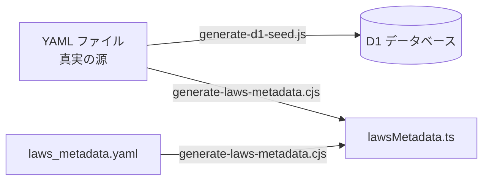

# データモデル仕様書

> 最終更新: 2026-02-21
> 対象: ソースコードの実装に基づく実態記録

---

## 1. 概要

osaka-kenpo のデータは3つの層で管理される:

1. **YAML ファイル**（真実の源）: `src/data/laws/` に格納された法律データ
2. **D1 データベース**（ランタイム）: YAML から生成された SQL で構築
3. **lawsMetadata.ts**（ビルド時生成）: 法律一覧の静的メタデータ



## 2. 法律カテゴリ体系

### カテゴリ ID

| ID           | 日本語名     | 説明                                                 |
| ------------ | ------------ | ---------------------------------------------------- |
| `jp`         | 日本・現行法 | 六法 + AI基本法                                      |
| `jp_hist`    | 日本・歴史法 | 十七条憲法、御成敗式目、大日本帝国憲法 等            |
| `world`      | 外国・現行法 | ドイツ基本法、アメリカ合衆国憲法、中華人民共和国憲法 |
| `world_hist` | 外国・歴史法 | マグナ・カルタ、ナポレオン法典、ハンムラビ法典 等    |
| `treaty`     | 国際条約     | 国連憲章、南極条約、WHO憲章 等                       |

定数定義: `src/lib/types.ts` の `LAW_CATEGORIES`

### 表示カテゴリ（lawsMetadata）

lawsMetadata.ts では、上記の技術的なカテゴリとは別に、UI表示用のカテゴリグループを定義する:

| 表示カテゴリ ID   | 表示名                 | アイコン | 含まれる法律カテゴリ |
| ----------------- | ---------------------- | -------- | -------------------- |
| `shinchaku`       | できたてホカホカやで   | 🍚       | jp（AI推進法）       |
| `roppou`          | ろっぽう（＋会社法）   | ⚖️       | jp                   |
| `mukashi`         | むかしの法律           | 📜       | jp_hist              |
| `gaikoku`         | がいこくの法律         | 🌍       | world                |
| `gaikoku_mukashi` | がいこくのむかしの法律 | 🏛️       | world_hist           |
| `treaty`          | 国際じょうやく         | 🤝       | treaty               |

## 3. YAML ファイル構造

### 3.1 ディレクトリ構造

```
src/data/laws/
├── {category}/
│   └── {law_id}/
│       ├── law_metadata.yaml       # 法律メタデータ（必須）
│       ├── chapters.yaml           # 章構成（任意）
│       ├── famous_articles.yaml    # 有名条文バッジ（任意）
│       ├── 1.yaml                  # 条文データ
│       ├── 2.yaml
│       ├── 132-2.yaml              # 枝番条文
│       ├── suppl-1.yaml            # 附則
│       └── ...
└── laws_metadata.yaml              # カテゴリ・法律一覧定義
```

### 3.2 laws_metadata.yaml

法律の一覧とカテゴリ構造を定義する。lawsMetadata.ts の生成元。

```yaml
categories:
  - id: roppou
    title: ろっぽう（＋会社法）
    icon: ⚖️
    laws:
      - id: constitution
        path: /law/jp/constitution
        status: available # 'available' | 'preparing'
      - id: minpou
        path: /law/jp/minpou
        status: available
```

`status: preparing` の法律はトップページでグレーカード「準備中やで」として表示される。

### 3.3 law_metadata.yaml

各法律のメタデータ。Zod スキーマ: `LawMetadataSchema`（`src/lib/schemas/law_metadata.ts`）

```yaml
name: 民法 # 正式名（display_name として D1 に格納）
shortName: 民法 # 通称名（省略可）
year: 1896 # 制定年
badge: '民のルールの土台や！' # バッジテキスト（省略可）
source: e-Gov法令検索 # 出典
description: 明治29年制定の民法。... # 説明
links: # 関連リンク（省略可）
  - text: e-Gov法令検索
    url: https://elaws.e-gov.go.jp/...
```

### 3.4 条文 YAML（{article}.yaml）

ファイル名は条文番号。Zod スキーマ: `ArticleSchema`（`src/lib/schemas/article.ts`）

```yaml
article: 1 # 条文番号（数値 or 文字列）
isSuppl: false # 附則フラグ（省略可）
isDeleted: false # 削除済みフラグ（省略可）
title: 基本原則 # 条文タイトル
titleOsaka: '' # 条文タイトル大阪弁版（省略可）
originalText: # 原文（段落の配列、必須）
  - 私権は、公共の福祉に適合しなければならない。
  - 権利の行使及び義務の履行は、...
osakaText: # 大阪弁翻訳（段落の配列）
  - 私権は、公共の福祉に適合せなあかん。
  - 権利の行使及び義務の履行は、...
commentary: # 解説文（段落の配列）
  - 民法第1条は、民法全体を貫く三つの...
commentaryOsaka: # 解説文大阪弁版（段落の配列、省略可）
  - 民法の一番大事な条文やで。...
```

**条文番号のバリエーション**:

- 通常: `1`, `2`, ... `1273`
- 枝番: `132-2`, `876-5`（ファイル名: `132-2.yaml`）
- 附則: `suppl-1`, `suppl-2`（`isSuppl: true`）
- 修正条項: `amend-1`（アメリカ合衆国憲法等）

### 3.5 chapters.yaml

```yaml
chapters:
  - chapter: 1
    title: 第一編 総則
    titleOsaka: null
    description: null
    descriptionOsaka: null
    articles: # この章に含まれる条文番号の配列
      - '1'
      - '2'
      - '3'
```

### 3.6 famous_articles.yaml

```yaml
'1': 基本原則
'709': 不法行為の一般原則
'90': 公序良俗
```

キーが条文番号、値がバッジテキスト。

## 4. D1 スキーマ

ソース: `db/schema.sql`

### 4.1 laws テーブル（法律メタデータ）

```sql
CREATE TABLE laws (
  id INTEGER PRIMARY KEY AUTOINCREMENT,
  category TEXT NOT NULL,           -- 'jp', 'jp_hist', 'world', 'world_hist', 'treaty'
  name TEXT NOT NULL,               -- 法律ID（'constitution', 'minpou' 等）
  display_name TEXT NOT NULL,       -- 正式名称（'日本国憲法'）
  short_name TEXT,                  -- 通称（'民法'）
  badge TEXT,                       -- バッジテキスト
  year INTEGER,                     -- 制定年
  source TEXT,                      -- 出典
  description TEXT,                 -- 説明
  links TEXT,                       -- JSON配列
  UNIQUE(category, name)
);
```

### 4.2 articles テーブル（条文データ）

```sql
CREATE TABLE articles (
  id INTEGER PRIMARY KEY AUTOINCREMENT,
  category TEXT NOT NULL,
  law_name TEXT NOT NULL,
  article TEXT NOT NULL,            -- '1', '132-2', 'suppl-1' 等
  is_suppl INTEGER DEFAULT 0,       -- 附則フラグ
  is_deleted INTEGER DEFAULT 0,     -- 削除済みフラグ
  title TEXT,
  title_osaka TEXT,
  original_text TEXT,               -- JSON配列（段落）
  osaka_text TEXT,                  -- JSON配列（段落）
  commentary TEXT,                  -- JSON配列（段落）
  commentary_osaka TEXT,            -- JSON配列（段落）
  UNIQUE(category, law_name, article)
);

CREATE INDEX idx_articles_law ON articles(category, law_name);
```

テキストフィールド（`original_text`, `osaka_text`, `commentary`, `commentary_osaka`）は JSON 文字列として格納される。各段落が配列の要素となる。

### 4.3 chapters テーブル（章構成）

```sql
CREATE TABLE chapters (
  id INTEGER PRIMARY KEY AUTOINCREMENT,
  category TEXT NOT NULL,
  law_name TEXT NOT NULL,
  chapter INTEGER NOT NULL,
  title TEXT NOT NULL,
  title_osaka TEXT,
  description TEXT,
  description_osaka TEXT,
  articles TEXT,                    -- JSON配列（章に含まれる条文番号）
  UNIQUE(category, law_name, chapter)
);

CREATE INDEX idx_chapters_law ON chapters(category, law_name);
```

### 4.4 famous_articles テーブル（有名条文バッジ）

```sql
CREATE TABLE famous_articles (
  id INTEGER PRIMARY KEY AUTOINCREMENT,
  category TEXT NOT NULL,
  law_name TEXT NOT NULL,
  article TEXT NOT NULL,
  badge TEXT NOT NULL,
  UNIQUE(category, law_name, article)
);

CREATE INDEX idx_famous_articles_law ON famous_articles(category, law_name);
```

### 4.5 user_likes テーブル（ええやん個人記録）

```sql
CREATE TABLE user_likes (
  user_id TEXT NOT NULL,
  category TEXT NOT NULL,
  law_name TEXT NOT NULL,
  article TEXT NOT NULL,
  created_at TEXT NOT NULL DEFAULT (datetime('now')),
  PRIMARY KEY (user_id, category, law_name, article)
);

CREATE INDEX idx_user_likes_user ON user_likes(user_id);
CREATE INDEX idx_user_likes_law ON user_likes(user_id, category, law_name);
```

他のテーブルとは異なり、`user_likes` はユーザーが生成するデータであり、YAML からは生成されない。

### 4.6 articles_fts テーブル（全文検索）

```sql
CREATE VIRTUAL TABLE articles_fts USING fts5(
  category, law_name, article,
  title, title_osaka,
  original_text, osaka_text,
  commentary, commentary_osaka,
  content='articles',
  content_rowid='id'
);
```

`articles` テーブルと自動同期するトリガー（INSERT, UPDATE, DELETE）が設定されている。

推測: 現時点では FTS を使用する検索機能は UI 上に実装されていない。将来の検索機能用に準備されている。

## 5. lawsMetadata.ts 自動生成の仕組み

### 生成スクリプト

`scripts/tools/generate-laws-metadata.cjs`

### 生成プロセス

1. `src/data/laws_metadata.yaml` を読み込む（カテゴリ構造、法律ID、パス、status）
2. 各法律の `src/data/laws/{category}/{law_id}/law_metadata.yaml` を読み込む（shortName, year, badge）
3. 両方をマージして TypeScript コードを生成
4. `src/data/lawsMetadata.ts` に書き出す

### 実行タイミング

- `npm run build` 時に `prebuild` フックで自動実行
- 手動: `npm run generate:metadata`

### 生成される型

```typescript
export interface LawEntry {
  id: string; // 法律ID（例: 'minpou'）
  shortName: string; // 通称（例: '民法'）
  path: string; // URLパス（例: '/law/jp/minpou'）
  status: 'available' | 'preparing';
  year?: number | null;
  badge?: string | null;
}

export interface CategoryEntry {
  id: string; // 表示カテゴリID（例: 'roppou'）
  title: string; // 表示名（例: 'ろっぽう（＋会社法）'）
  icon: string; // 絵文字（例: '⚖️'）
  laws: LawEntry[];
}

export interface LawsMetadata {
  categories: CategoryEntry[];
}
```

## 6. D1 データベースアクセス関数

`src/lib/db.ts` に定義。全て Edge Runtime で動作。

| 関数                                       | SQL                                                         | 戻り値                   | 使用箇所                            |
| ------------------------------------------ | ----------------------------------------------------------- | ------------------------ | ----------------------------------- |
| `getDB()`                                  | -                                                           | D1 バインディング        | 全関数の基盤                        |
| `getLaws()`                                | `SELECT ... FROM laws ORDER BY category, name`              | `LawRow[]`               | 未使用（lawsMetadata.ts で代替）    |
| `getLawsByCategory(category)`              | `SELECT DISTINCT law_name FROM articles WHERE category = ?` | `{ name }[]`             | 推測: 未使用                        |
| `getArticles(category, lawName)`           | `SELECT ... FROM articles WHERE ... ORDER BY ...`           | `ArticleRow[]`           | 法律ページ、条文ページ              |
| `getArticle(category, lawName, articleId)` | `SELECT * FROM articles WHERE ...`                          | `ArticleRow \| null`     | 条文ページ、OG 画像生成             |
| `getLawMetadata(category, lawName)`        | `SELECT * FROM laws WHERE ...`                              | `LawRow \| null`         | 法律ページ、条文ページ、OG 画像生成 |
| `getChapters(category, lawName)`           | `SELECT * FROM chapters WHERE ... ORDER BY chapter`         | `ChapterRow[]`           | 法律ページ                          |
| `getFamousArticles(category, lawName)`     | `SELECT article, badge FROM famous_articles WHERE ...`      | `Record<string, string>` | 法律ページ                          |

### 条文のソート順

`getArticles()` のソート:

```sql
ORDER BY
  CASE WHEN article GLOB '[0-9]*' THEN CAST(article AS INTEGER) ELSE 9999 END,
  article
```

数値で始まる条文は数値順、それ以外（`suppl-`, `amend-`）は末尾に配置される。

## 7. D1 Seed SQL 生成

### 生成スクリプト

`scripts/tools/generate-d1-seed.js`

### 生成プロセス

1. `src/data/laws/` のカテゴリディレクトリを走査
2. 各法律ディレクトリ内の YAML ファイルを読み込み:
   - `law_metadata.yaml` → `INSERT INTO laws ...`
   - `chapters.yaml` → `INSERT INTO chapters ...`
   - `famous_articles.yaml` → `INSERT INTO famous_articles ...`
   - `{article}.yaml`（上記3ファイル以外） → `INSERT INTO articles ...`
3. 全 INSERT 文を標準出力に書き出す

### 実行

```bash
node scripts/tools/generate-d1-seed.js > db/seed.sql
```

配列フィールド（`originalText`, `osakaText` 等）は `JSON.stringify()` で文字列化してから SQL に埋め込まれる。

## 8. Zod スキーマ

`src/lib/schemas/` に定義。YAML データの型安全性を保証する。

### ArticleSchema

```typescript
const ArticleSchema = z.object({
  article: z.union([z.number().int().positive(), z.string().min(1)]),
  title: z.string(),
  titleOsaka: z.string().optional(),
  originalText: z.array(z.string().min(1)).min(1), // 必須
  osakaText: z.array(z.string().min(1)),
  commentary: z.array(z.string().min(1)),
  commentaryOsaka: z.array(z.string().min(1)).optional(),
});
```

### LawMetadataSchema

```typescript
const LawMetadataSchema = z.object({
  name: z.string().min(1),
  shortName: z.string().optional(),
  badge: z.string().optional(),
  year: z.number().int(),
  source: z.string().min(1),
  description: z.string().min(1),
  links: z.array(LinkSchema).optional(),
});
```

## 9. localStorage データ構造

単一キー `osaka-kenpo` に JSON オブジェクトとして格納（`src/lib/storage.ts`）。

```typescript
interface OsakaKenpoStorage {
  viewMode: ViewMode; // 'osaka' | 'original'
  eeyan: {
    userId: string; // UUID v4。空文字 = 未生成
  };
}
```

デフォルト: `{ viewMode: 'osaka', eeyan: { userId: '' } }`
