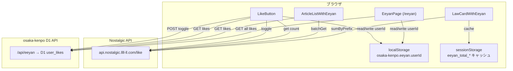
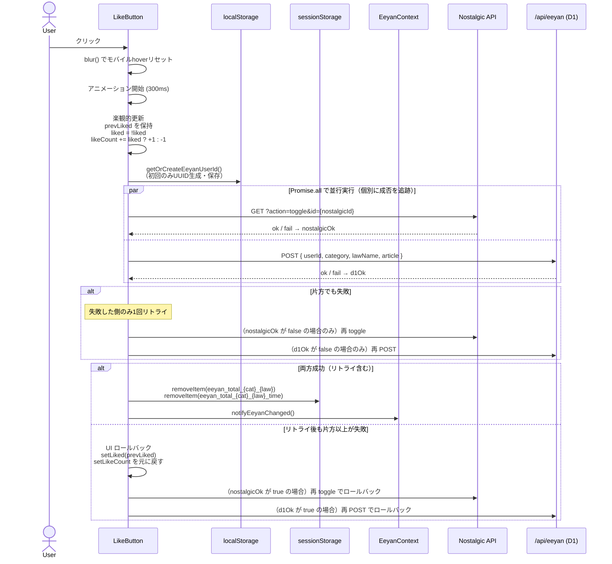
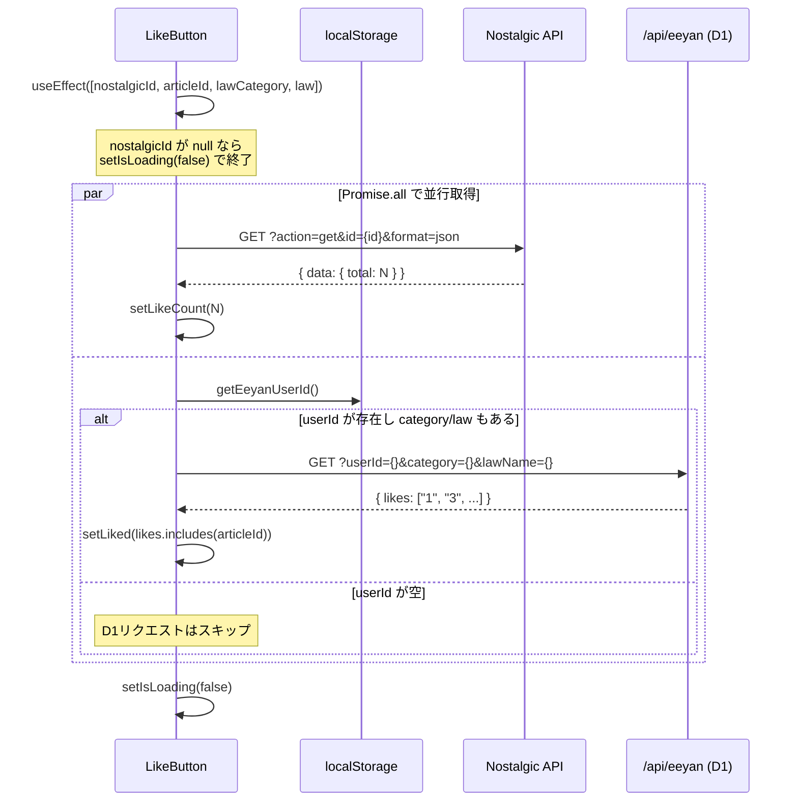
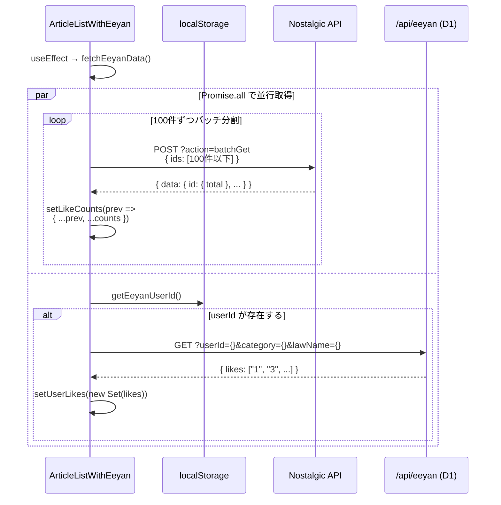
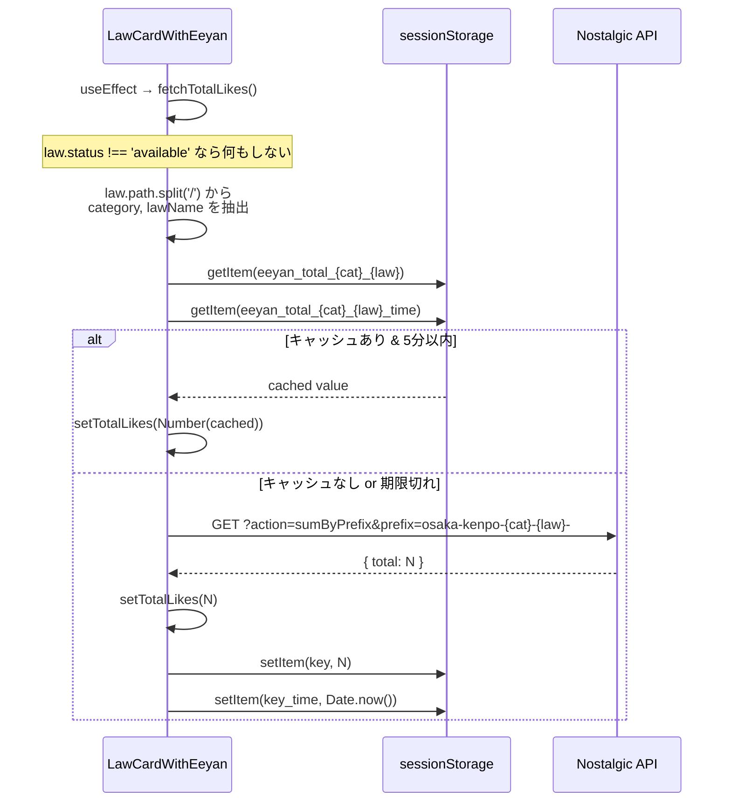
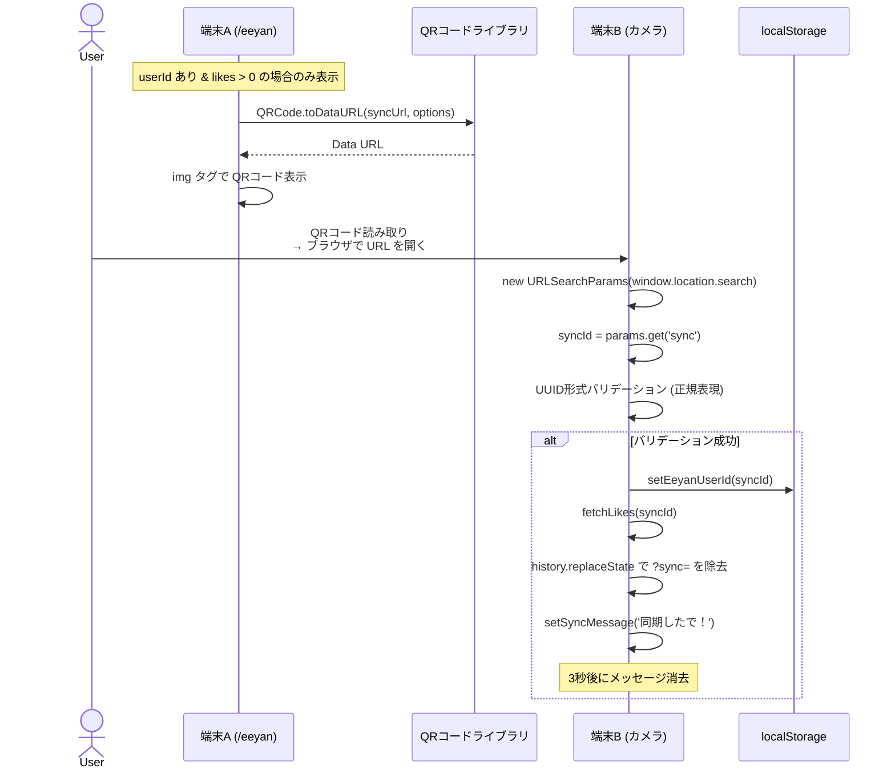
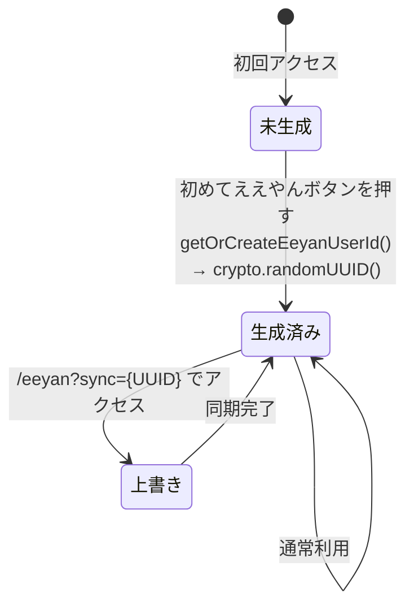

# ええやんシステム技術仕様書

> 最終更新: 2026-02-21
> 対象: ソースコードの実装に基づく実態記録

---

## 1. システム概要

「ええやん」は osaka-kenpo における「いいね」機能であり、以下の2つの独立したバックエンドに**二重登録**する方式で動作する。

| バックエンド                   | 役割                     | 管理対象                   |
| ------------------------------ | ------------------------ | -------------------------- |
| **Nostalgic API**（外部）      | グローバルないいね合計数 | 全ユーザーの合計カウント   |
| **osaka-kenpo D1 API**（内部） | ユーザー個人のいいね記録 | 誰がどの条文にいいねしたか |

この二重構成により、匿名のグローバルカウント（Nostalgic）と、個人のいいね履歴管理（D1）を分離している。

### アーキテクチャ図



## 2. API仕様

### 2.1 Nostalgic API

**ベースURL**: `https://api.nostalgic.llll-ll.com/like`

定数: `NOSTALGIC_API_BASE`（`src/lib/eeyan.ts`）

Nostalgic API における ID は以下の関数で生成される:

```typescript
// src/lib/eeyan.ts - getNostalgicId()
function getNostalgicId(category: string, lawName: string, article: string): string {
  return `osaka-kenpo-${category}-${lawName}-${article}`;
}
```

例: `osaka-kenpo-jp-minpou-1`（民法第1条）

#### 2.1.1 toggle（いいねトグル）

カウントを +1 または -1 する。

**リクエスト**:

```
GET https://api.nostalgic.llll-ll.com/like?action=toggle&id={nostalgicId}
```

**使用箇所**: `LikeButton.handleLike`

レスポンスは `.catch(() => {})` で無視されており、使用していない。

#### 2.1.2 get（単一IDのカウント取得）

**リクエスト**:

```
GET https://api.nostalgic.llll-ll.com/like?action=get&id={nostalgicId}&format=json
```

**レスポンス**:

```json
{
  "success": true,
  "data": {
    "total": 42
  }
}
```

**使用箇所**: `LikeButton` の useEffect（マウント時の初期状態取得）

#### 2.1.3 batchGet（複数IDのカウント一括取得）

**リクエスト**:

```
POST https://api.nostalgic.llll-ll.com/like?action=batchGet
Content-Type: application/json

{
  "ids": ["osaka-kenpo-jp-minpou-1", "osaka-kenpo-jp-minpou-2", ...]
}
```

**制限**: 1回あたり最大100件。定数 `NOSTALGIC_BATCH_LIMIT = 100`（`src/lib/eeyan.ts`）。101件以上で500エラー。

**レスポンス**:

```json
{
  "success": true,
  "data": {
    "osaka-kenpo-jp-minpou-1": { "total": 5 },
    "osaka-kenpo-jp-minpou-2": { "total": 12 }
  }
}
```

**使用箇所**: `ArticleListWithEeyan`（法律ページの条文一覧）

条文数が100件を超える法律（例: 民法1,273条）では、100件ずつ分割して複数回リクエストする。各バッチの結果は `setLikeCounts(prev => ({ ...prev, ...counts }))` でマージされる。

#### 2.1.4 sumByPrefix（プレフィックスで合計取得）

**リクエスト**:

```
GET https://api.nostalgic.llll-ll.com/like?action=sumByPrefix&prefix={prefix}
```

プレフィックス形式: `osaka-kenpo-{category}-{lawName}-`

**レスポンス**:

```json
{
  "success": true,
  "total": 256
}
```

**使用箇所**: `LawCardWithEeyan`（トップページの法律カード）。その法律の全条文のいいね合計を1回のAPIコールで取得する。

### 2.2 osaka-kenpo D1 API

**エンドポイント**: `/api/eeyan`
**ランタイム**: Edge（`export const runtime = 'edge'`）
**ソース**: `src/app/api/eeyan/route.ts`
**DB取得**: `getRequestContext().env.DB`（Cloudflare D1バインディング）

#### 2.2.1 POST /api/eeyan（ええやんトグル）

ユーザーの個人いいね状態をトグルする。レコードが存在すれば DELETE、存在しなければ INSERT。

**リクエスト**:

```
POST /api/eeyan
Content-Type: application/json

{
  "userId": "550e8400-e29b-41d4-a716-446655440000",
  "category": "jp",
  "lawName": "minpou",
  "article": "1"
}
```

**バリデーション**:

- 4フィールド全て必須（欠けると 400: `userId, category, lawName, article are required`）
- `userId` は UUID 形式（正規表現: `/^[0-9a-f]{8}-[0-9a-f]{4}-[0-9a-f]{4}-[0-9a-f]{4}-[0-9a-f]{12}$/i`、違反で 400: `Invalid userId format`）

**SQL（いいね済みか確認）**:

```sql
SELECT 1 FROM user_likes WHERE user_id = ? AND category = ? AND law_name = ? AND article = ?
```

**SQL（いいね追加）**:

```sql
INSERT INTO user_likes (user_id, category, law_name, article) VALUES (?, ?, ?, ?)
```

**SQL（いいね解除）**:

```sql
DELETE FROM user_likes WHERE user_id = ? AND category = ? AND law_name = ? AND article = ?
```

**レスポンス（いいね追加時）**:

```json
{ "success": true, "liked": true }
```

**レスポンス（いいね解除時）**:

```json
{ "success": true, "liked": false }
```

**エラーレスポンス**:

```json
{ "error": "userId, category, lawName, article are required" }  // 400
{ "error": "Invalid userId format" }                             // 400
{ "error": "Internal server error" }                             // 500
```

#### 2.2.2 GET /api/eeyan（ええやん一覧取得）

2つのモードがある。`category` と `lawName` の両方が指定されているかどうかで分岐する。

**モード1: 法律ごとの条文ID一覧**（category + lawName 指定時）

```
GET /api/eeyan?userId={uuid}&category={category}&lawName={lawName}
```

**SQL**:

```sql
SELECT article FROM user_likes
WHERE user_id = ? AND category = ? AND law_name = ?
ORDER BY article
```

**レスポンス**:

```json
{
  "success": true,
  "likes": ["1", "3", "132-2"]
}
```

**使用箇所**: `LikeButton`（初期状態判定）、`ArticleListWithEeyan`（条文一覧のハート色判定）

**モード2: 全法律横断の詳細一覧**（category・lawName 省略時）

```
GET /api/eeyan?userId={uuid}
```

**SQL**:

```sql
SELECT ul.category, ul.law_name as lawName, ul.article, ul.created_at as createdAt,
       a.title, a.original_text as originalText
FROM user_likes ul
LEFT JOIN articles a ON ul.category = a.category AND ul.law_name = a.law_name AND ul.article = a.article
WHERE ul.user_id = ?
ORDER BY ul.created_at DESC
```

**レスポンス**:

```json
{
  "success": true,
  "likes": [
    {
      "category": "jp",
      "lawName": "minpou",
      "article": "1",
      "createdAt": "2026-02-20 12:34:56",
      "title": "（権利能力）",
      "originalText": "私権の享有は、出生に始まる。"
    }
  ]
}
```

`originalText` は DB上 JSON 配列として格納されているため、API側で `JSON.parse()` して最初の要素のみ文字列として返す。パース失敗時は空文字。

**使用箇所**: `EeyanPage`（/eeyan ページ）

## 3. データベーススキーマ

### user_likes テーブル（`db/schema.sql`）

```sql
CREATE TABLE user_likes (
  user_id TEXT NOT NULL,
  category TEXT NOT NULL,
  law_name TEXT NOT NULL,
  article TEXT NOT NULL,
  created_at TEXT NOT NULL DEFAULT (datetime('now')),
  PRIMARY KEY (user_id, category, law_name, article)
);

CREATE INDEX idx_user_likes_user ON user_likes(user_id);
CREATE INDEX idx_user_likes_law ON user_likes(user_id, category, law_name);
```

- 複合主キーにより、同一ユーザーが同一条文を重複いいねすることはない
- `created_at` は SQLite の `datetime('now')` で UTC タイムスタンプ
- `schema.sql` では `DROP TABLE IF EXISTS user_likes` でフルリビルドされる

## 4. 状態管理

### 4.1 localStorage

単一キー `osaka-kenpo` に JSON オブジェクトとして格納（`src/lib/storage.ts`）。

```typescript
const STORAGE_KEY = 'osaka-kenpo';

interface OsakaKenpoStorage {
  viewMode: ViewMode; // 'osaka' | 'original' | 'both'
  eeyan: {
    userId: string; // UUID v4 形式。空文字 = 未生成
  };
}
```

**デフォルト値**:

```json
{
  "viewMode": "osaka",
  "eeyan": { "userId": "" }
}
```

**userId の生成タイミング**: ユーザーが初めて「ええやん」ボタンを押した瞬間。`getOrCreateEeyanUserId()` は `LikeButton` の `handleLike` 内でのみ呼ばれるため、ページ閲覧だけでは userId は生成されない。

**読み書き関数**（`src/lib/storage.ts`）:

| 関数                       | 動作                                                                        |
| -------------------------- | --------------------------------------------------------------------------- |
| `getEeyanUserId()`         | `readStorage().eeyan.userId` を返す。未生成なら空文字                       |
| `setEeyanUserId(id)`       | `updateStorage('eeyan', ...)` で userId を保存                              |
| `getOrCreateEeyanUserId()` | 既存があればそれを返し、なければ `crypto.randomUUID()` で生成して保存し返す |

`readStorage()` は `localStorage.getItem(STORAGE_KEY)` をパースし、`viewMode` と `eeyan` をデフォルト値とマージする。`localStorage` が未定義の環境（SSR）ではデフォルト値を返す。

### 4.2 sessionStorage（キャッシュ）

`LawCardWithEeyan` のみが使用する。

| キー                                    | 値                       | 備考              |
| --------------------------------------- | ------------------------ | ----------------- |
| `eeyan_total_{category}_{lawName}`      | 数値（文字列）           | 合計いいね数      |
| `eeyan_total_{category}_{lawName}_time` | タイムスタンプ（文字列） | `Date.now()` の値 |

**TTL**: 5分（`5 * 60 * 1000` ミリ秒）。TTL 内はキャッシュから `setTotalLikes()` して API リクエストしない。

**キャッシュ無効化**: `visibilitychange` イベントで `visible` になったとき、sessionStorage の該当キー2つを `removeItem()` してから `fetchTotalLikes()` を再呼び出しする。

### 4.3 React state

各コンポーネントのローカルステートで管理。グローバルな状態管理ライブラリは使用していない。

| コンポーネント         | state         | 型                         | 用途                               |
| ---------------------- | ------------- | -------------------------- | ---------------------------------- |
| `LikeButton`           | `liked`       | `boolean`                  | このユーザーがいいね済みか         |
| `LikeButton`           | `likeCount`   | `number`                   | この条文のグローバルカウント       |
| `LikeButton`           | `isAnimating` | `boolean`                  | ボタンアニメーション中（300ms）    |
| `LikeButton`           | `isLoading`   | `boolean`                  | 初期データ取得中                   |
| `ArticleListWithEeyan` | `likeCounts`  | `Record<string, number>`   | 条文ID → グローバルカウント        |
| `ArticleListWithEeyan` | `userLikes`   | `Set<string>`              | いいね済み条文IDのセット           |
| `LawCardWithEeyan`     | `totalLikes`  | `number \| null`           | 法律全体の合計（null=未取得）      |
| `EeyanPage`            | `likes`       | `LikeEntry[]`              | ユーザーの全いいねリスト           |
| `EeyanPage`            | `userId`      | `string`                   | 表示用ユーザーID                   |
| `EeyanPage`            | `sortModes`   | `Record<string, SortMode>` | グループキー → 'date' \| 'article' |
| `EeyanPage`            | `syncMessage` | `string`                   | 同期完了メッセージ（3秒表示）      |
| `EeyanPage`            | `copied`      | `boolean`                  | コピー完了フラグ（2秒表示）        |
| `EeyanPage`            | `qrDataUrl`   | `string`                   | QRコードの Data URL                |

## 5. データフロー

### 5.1 ええやんボタン押下シーケンス



**実装上の特性**:

- **楽観的更新**: APIコール前に `setLiked(!liked)` と `setLikeCount(prev => newLiked ? prev + 1 : Math.max(0, prev - 1))` で即座にUIを更新
- **リトライ**: 片方が失敗した場合、失敗した側のみ1回リトライする
- **ロールバック**: リトライ後も失敗した場合、UIを元に戻し、成功した側も再toggleしてバックエンドの整合性を保つ
- **並行実行**: `Promise.all` で Nostalgic と D1 を同時呼び出し、個別に成否を追跡（`res.ok` / `.catch(() => false)`）
- **キャッシュ無効化**: 両方成功時のみ sessionStorage キャッシュを削除し、`notifyEeyanChanged()` で他コンポーネントに通知
- **ページ間同期**: `EeyanContext` の `revision` インクリメントにより、`ArticleListWithEeyan` と `LawCardWithEeyan` が再取得する

### 5.2 初期状態取得フロー（LikeButton マウント時）



### 5.3 条文一覧取得フロー（ArticleListWithEeyan）



batchGet レスポンスから条文IDを復元する処理:

```typescript
const prefix = `osaka-kenpo-${lawCategory}-${law}-`;
if (nostalgicId.startsWith(prefix)) {
  const articleId = nostalgicId.slice(prefix.length);
  counts[articleId] = info.total;
}
```

### 5.4 法律カード合計取得フロー（LawCardWithEeyan）



## 6. ページ別表示仕様

### 6.1 トップページ（法律カード一覧）

**コンポーネント**: `LawCardWithEeyan`（`src/app/components/LawCardWithEeyan.tsx`）

- `law.status === 'available'` の法律のみカウント取得。`available` 以外はグレーカードで「準備中やで」と表示
- Nostalgic API の `sumByPrefix` で法律全体の合計いいね数を1回のAPIコールで取得
- カード右下に `{total.toLocaleString()} ええやん` をハートアイコン付きで表示
- ハートアイコンは SVG（枠線のみ、`fill="none"`）
- テキスト色: `#FFB6C1`（カード背景 `#E94E77` に対する薄ピンク）
- `totalLikes === null`（未取得/エラー時）は何も表示しない

### 6.2 法律ページ（条文一覧）

**コンポーネント**: `ArticleListWithEeyan`（`src/app/law/[law_category]/[law]/components/ArticleListWithEeyan.tsx`）→ `ArticleListItem`（`src/app/components/ArticleListItem.tsx`）

- Nostalgic API の `batchGet` で全条文のグローバルカウントを一括取得（100件ずつ分割）
- D1 API の GET（モード1）で自分がいいねした条文IDセットを取得
- 各条文カードの右下に `{likeCount} ええやん` をハートアイコン付きで表示

**ArticleListItem の表示ルール**:

| 条件                 | ハートアイコン                      | テキスト色       | 備考                     |
| -------------------- | ----------------------------------- | ---------------- | ------------------------ |
| `isDeleted === true` | 非表示                              | -                | 削除条文はいいね表示なし |
| `isLiked === true`   | `fill="currentColor"`（塗りつぶし） | `text-[#E94E77]` | 自分がいいね済み         |
| `isLiked === false`  | `fill="none"`（枠線のみ）           | `text-gray-400`  | 未いいね                 |

`likeCount` のデフォルト値は `0`（props 未指定時）。

### 6.3 条文ページ（個別条文）

**コンポーネント**: `LikeButton`（`src/app/components/LikeButton.tsx`）

- Nostalgic API の `get` で単一条文のグローバルカウントを取得
- D1 API の GET（モード1）で自分がいいねした条文一覧を取得し、`likes.includes(articleId)` で判定
- `articleId`, `lawCategory`, `law` の全てが揃わないと `nostalgicId` が `null` となり、ボタンは何もしない

**ボタン表示ルール**:

| 状態                           | 背景色    | 文字色    | ボーダー                 |
| ------------------------------ | --------- | --------- | ------------------------ |
| いいね済み（`liked === true`） | `#E94E77` | 白        | `#E94E77`                |
| 未いいね                       | 白        | `#E94E77` | `#E94E77`                |
| 読み込み中                     | -         | -         | `opacity-50`, `disabled` |

- クリック時アニメーション: `scale-110` → `scale-100`（300ms）
- ホバー時: `hover:shadow-md`
- アクティブ時: `active:scale-95`
- ツールチップ: いいね済み→「ええやん取り消し」、未いいね→「ええやん！」

### 6.4 /eeyan ページ（わたしのええやん）

**コンポーネント**: `EeyanPage`（`src/app/eeyan/page.tsx`）

- D1 API の GET（モード2: 全法律横断）でユーザーの全いいねを取得
- `lawsMetadata` を使って法律のショートネームを表示（`getLawDisplayName()`）
- 法律別にグループ化（`{category}/{lawName}` をキーにした `reduce`）
- 各グループ内で並び替え可能:
  - **日時順**（デフォルト）: `createdAt` 降順
  - **条文順**: `getArticleSortKey()` で数値ソート
- 並び替えボタンは各グループのヘッダ右に配置

**表示状態**:

| 条件                                    | 表示内容                                                                               |
| --------------------------------------- | -------------------------------------------------------------------------------------- |
| `isLoading === true`                    | 「読み込み中...」                                                                      |
| `userId` が空（一度もいいねしていない） | 「まだええやんしたことないみたいやな。条文ページで「ええやん」ボタンを押してみてな！」 |
| `userId` はあるが `likes.length === 0`  | 同上                                                                                   |
| `likes.length > 0`                      | 法律別グループ表示 + 端末間同期セクション                                              |

**条文アイテム表示**:

- タイトルがある場合: `dangerouslySetInnerHTML` でHTML描画（HTMLタグ含む可能性）
- タイトルがない場合: `getExcerpt(originalText, 40)` で原文の冒頭40文字を表示（イタリック・グレー）
- 右端に `formatDate(createdAt)` で日付表示（YYYY-MM-DD形式）

## 7. 自分 vs 他人の表示ルール

「自分がいいね済みか」の判定は**全て D1 API の応答**に基づく。Nostalgic API はグローバルカウントのみでユーザー識別を提供しない。

| 要素                         | 自分がいいね済み                    | それ以外                  |
| ---------------------------- | ----------------------------------- | ------------------------- |
| `LikeButton` 背景            | `#E94E77`                           | 白                        |
| `LikeButton` 文字            | 白                                  | `#E94E77`                 |
| `ArticleListItem` ハート     | 塗りつぶし（`fill="currentColor"`） | 枠線のみ（`fill="none"`） |
| `ArticleListItem` テキスト色 | `#E94E77`                           | `text-gray-400`           |

**判定フロー**:

1. `localStorage` から `getEeyanUserId()` で userId を取得
2. userId が空文字 → D1 API を呼ばない → 全て未いいね表示
3. userId が存在 → D1 API `GET /api/eeyan?userId=...&category=...&lawName=...` で条文ID配列を取得
4. `likes.includes(articleId)` または `userLikes.has(articleId)` で判定

## 8. エラーハンドリング

### 8.1 ええやんトグルのエラーリカバリ

ええやんトグル時、Nostalgic API と D1 API は `Promise.all` で並行実行され、個別に成否を追跡する。失敗した場合は **リトライ→ロールバック** の段階的リカバリを行う。

**フロー**:

1. Nostalgic toggle と D1 POST を並行実行、各々 `res.ok` / `.catch(() => false)` で成否判定
2. 片方でも失敗した場合、失敗した側のみ1回リトライ
3. リトライ後も失敗した場合:
   - UI を楽観的更新前の状態にロールバック（`setLiked(prevLiked)`, `setLikeCount` を元に戻す）
   - 成功した側を再 toggle してバックエンドの整合性を保つ

| Nostalgic | D1   | リトライ後             | 結果                                                   |
| --------- | ---- | ---------------------- | ------------------------------------------------------ |
| 成功      | 成功 | -                      | 正常: キャッシュ無効化 + `notifyEeyanChanged()`        |
| 成功      | 失敗 | D1 リトライ成功        | 正常                                                   |
| 失敗      | 成功 | Nostalgic リトライ成功 | 正常                                                   |
| 成功      | 失敗 | D1 リトライ失敗        | UI ロールバック + Nostalgic を再 toggle でロールバック |
| 失敗      | 成功 | Nostalgic リトライ失敗 | UI ロールバック + D1 を再 POST でロールバック          |
| 失敗      | 失敗 | 両方リトライ失敗       | UI ロールバック。バックエンドは変更なし                |

**注意**: ロールバック用の再 toggle 自体が失敗した場合は不整合が残る。ただし `Nostalgic API` はカウンターでありトグル動作のため、再試行で自然に修復される。

### 8.2 楽観的更新のリスク

`LikeButton` は API 呼び出し**前**に UI を更新する:

- 両 API が成功した場合: 楽観的更新がそのまま最終表示となる
- 両 API が失敗した場合（リトライ含む）: `setLiked(prevLiked)` と `setLikeCount` でUIをロールバックする
- `LikeButton` 自体は `visibilitychange` をリッスンしていない（`ArticleListWithEeyan` と `LawCardWithEeyan` のみ実装）

### 8.3 エラーハンドリングの層別整理

| 層                            | 挙動                                                                          |
| ----------------------------- | ----------------------------------------------------------------------------- |
| **LikeButton トグル**         | 個別成否追跡 → リトライ → ロールバック（セクション 8.1 参照）                 |
| **LikeButton 初期取得**       | `.catch(() => {})` でエラー無視。データなしで表示                             |
| **ArticleListWithEeyan 取得** | `.catch(() => {})` でエラー無視                                               |
| **LawCardWithEeyan 取得**     | `.catch(() => {})` でエラー無視。`totalLikes === null` でカウント非表示       |
| **D1 API サーバー側**         | `try-catch` で例外を捕捉し `{ error: 'Internal server error' }` を返す（500） |

## 9. QRコード同期（デバイス間ユーザーID共有）

ログイン機構がないため、ユーザーIDを URL パラメータ経由で別デバイスに渡すことでいいね履歴を同期する。

### 同期フロー



### QRコード生成仕様

- ライブラリ: `qrcode`（npm パッケージ、`QRCode.toDataURL()`）
- 埋め込みURL: `${window.location.origin}/eeyan?sync=${userId}`
- 設定:
  - エラー訂正レベル: `L`（低）
  - マージン: `2`
  - サイズ: `width: 160`（160x160px）
  - 色: dark `#000000` / light `#ffffff`
- 出力: Data URL → `` タグの `src` に直接設定

### 表示条件

端末間同期セクション全体の表示条件:

```typescript
{userId && likes.length > 0 && ( /* 同期セクション */ )}
```

つまり:

- `userId` が空でない（1回以上いいねしたことがある）
- `likes.length > 0`（現在いいね中の条文が1件以上ある）

### 手動コピー

QRコードに加え、ユーザーIDを直接コピーする手段も提供:

- `<code>` タグで UUID を表示（`text-xs bg-gray-100 break-all`）
- 「コピー」ボタン: `navigator.clipboard.writeText(userId)`
- コピー完了: ボタンテキストが「コピーしたで！」に2秒間変化

### セキュリティに関する注意

- UUID を知っていれば誰でもそのユーザーのええやんリストを GET で取得可能
- 認証は導入されていない（シンプルさ優先、法律学習ブックマークとして秘匿性要件が低いため）

## 10. キャッシュ戦略

### 10.1 sessionStorage キャッシュ（LawCardWithEeyan のみ）

| 項目   | 値                                                              |
| ------ | --------------------------------------------------------------- |
| 対象   | トップページの法律カード合計いいね数                            |
| TTL    | 5分（`5 * 60 * 1000` ms）                                       |
| キー   | `eeyan_total_{category}_{lawName}` + `_time`                    |
| 無効化 | `visibilitychange` で `visible` になったとき: キー削除 → 再取得 |

### 10.2 visibilitychange による再取得

| コンポーネント         | 挙動                                                                                   |
| ---------------------- | -------------------------------------------------------------------------------------- |
| `ArticleListWithEeyan` | `fetchEeyanData()` を再実行。キャッシュなし、常にAPI呼び出し                           |
| `LawCardWithEeyan`     | sessionStorage キャッシュを `removeItem()` で削除してから `fetchTotalLikes()` を再実行 |

### 10.3 キャッシュを持たないコンポーネント

| コンポーネント | 挙動                                                                           |
| -------------- | ------------------------------------------------------------------------------ |
| `LikeButton`   | キャッシュなし。マウント時に毎回APIを呼ぶ。`visibilitychange` のリスナーもなし |
| `EeyanPage`    | キャッシュなし。マウント時に1回だけ取得。`visibilitychange` のリスナーもなし   |

## 11. Nostalgic ID の構造

```
osaka-kenpo-{category}-{lawName}-{article}
```

| セグメント | 例                                               | 説明                  |
| ---------- | ------------------------------------------------ | --------------------- |
| `category` | `jp`, `jp_hist`, `world`, `world_hist`, `treaty` | 法律カテゴリ          |
| `lawName`  | `minpou`, `constitution`, `keihou`               | 法律名（URLスラッグ） |
| `article`  | `1`, `132-2`, `fusoku_1`                         | 条文番号              |

`ArticleListWithEeyan` の `batchGet` レスポンスから条文IDを復元する際:

```typescript
const prefix = `osaka-kenpo-${lawCategory}-${law}-`;
if (nostalgicId.startsWith(prefix)) {
  const articleId = nostalgicId.slice(prefix.length);
}
```

## 12. userId のライフサイクル



- **未生成状態**: `getEeyanUserId()` → `""`。D1 API は呼ばれず、全条文が未いいね表示
- **生成**: `getOrCreateEeyanUserId()` が `crypto.randomUUID()` を呼び、localStorage に保存
- **永続化先**: `localStorage` の `osaka-kenpo` → `eeyan.userId`
- **上書き**: `/eeyan?sync={uuid}` アクセス時に `setEeyanUserId(syncId)` で上書き。旧IDのデータは D1 上に残るがUIからはアクセスされなくなる
- **削除手段**: なし（ブラウザの localStorage を手動クリアするしかない）

## 13. 実装ファイル一覧

| ファイル                                                               | 役割                                                    |
| ---------------------------------------------------------------------- | ------------------------------------------------------- |
| `src/app/api/eeyan/route.ts`                                           | D1 API（POST トグル / GET 一覧）                        |
| `src/app/eeyan/page.tsx`                                               | /eeyan ページ（わたしのええやん + QR同期）              |
| `src/app/components/LikeButton.tsx`                                    | ええやんボタン（条文ページ）                            |
| `src/app/law/[law_category]/[law]/components/ArticleListWithEeyan.tsx` | 条文一覧のええやんデータ取得・供給                      |
| `src/app/components/ArticleListItem.tsx`                               | 条文カード（ハートアイコン表示）                        |
| `src/app/components/LawCardWithEeyan.tsx`                              | 法律カード（合計いいね表示）                            |
| `src/lib/eeyan.ts`                                                     | Nostalgic API 定数・ID生成・storage関数の再エクスポート |
| `src/lib/storage.ts`                                                   | localStorage 一元管理（userId CRUD）                    |
| `db/schema.sql`                                                        | D1 スキーマ（user_likes テーブル定義）                  |
